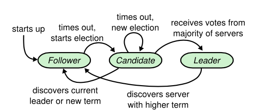
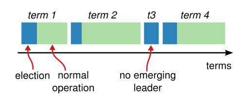
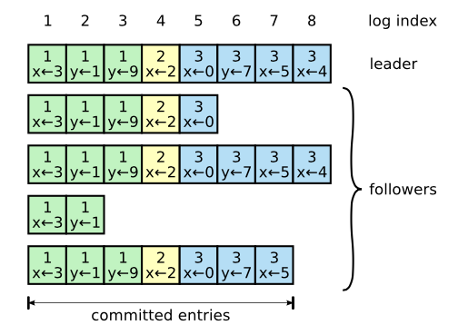
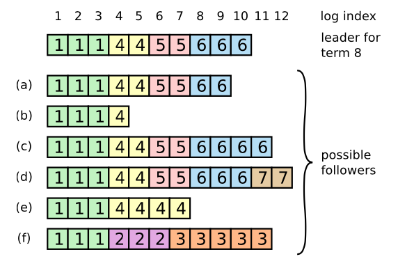
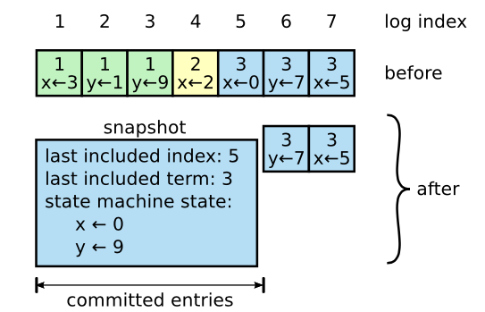

# Raft
Raft(Replication and Fault Tolerant) 是一个允许网络分区 (Partition Tolerant) 的一致性协议，它保证了在一个由 N 个节点构成的系统中有(N + 1) / 2 (向上取整) 个节点正常工作的情况下的系统的一致性。

## 功能
- [X] 领导选举
- [X] 日志复制
- [X] 安全性
- [X] 日志压缩
- [ ] 成员变更

## 概述
Raft 将系统中的节点分为领导者(leader)、跟随者(follower)和候选人(candidate)：
+ **leader:** 处理所有 client 请求(如果 client 联系了 follower，follower 会将其重定向给 leader)，并向 follower 同步请求日志，当日志同步到大多数节点上后告诉 follower 提交日志。
+ **follower:** 响应来自其他节点的请求，不发出任何请求，如果没有收到任何请求就会成为 candidate 并发起**领导选举**。
+ **candidate:** 从集群中获得多数选票的 candidate 将成为新的 leader，然后向所有其他节点发送心跳信息，以建立其权威并阻止新的选举。

Raft 将时间分为任意长度的 term，term 用连续的整数编号。
term 在 Raft 中充当逻辑时钟，它允许节点检测过时的信息，如陈旧的 leader。
每个 term 都以**领导选举**开始，在一次成功的选举后，一个 leader 管理集群直到 term 结束。
在某些情况下，选举会导致投票分裂，term 将在没有 leader 的情况下结束，新的 term (新的选举)即将开始，Raft 确保在一个给定的 term 内最多有一个 leader。

## 领导选举
Raft 使用心跳机制来触发领导选举，节点启动时以 follower 的身份开始，只要节点从 leader 或 candidate 那里接收到有效的 rpc，他就会保持 follower 状态。
leader 定期向所有 follower 发送心跳(AppendEntries rpc，不携带日志条目)，以维护他们的权威。
如果 follower 在 election timeout 时间内没有收到任何信息，那么它就假定没有可行的 leader，并开始选举一个新的 leader。

发起选举时，follower 变成 candidate，增加它的 currentTerm，为自己投票，并行地向集群中的每个其他节点发出 RequestVote rpc。
每个节点在给定的 term 内最多投票给一个 candidate (先到先得)，选举结果有以下三种情况：
+ candidate 在同一 term 内获得集群中大多数节点的选票，赢得选举。
+ 在等待投票时，candidate 可能会从 leader 收到一个 AppendEntries RPC，如果该 leader 的 term 至少与 candidate 的 currentTerm 一样大，那么 candidate 将认为 leader 是合法的，并返回到 follower 状态。
+ candidate 既不赢也不输（许多 follower 同时成为 candidate，选票可能被分割，因此没有一个 candidate 获得多数）， 当这种情况发生时，每个 candidate 将暂停并开始新的选举，通过增加其 term 启动另一轮请求投票rpc。为了减少选票分割的情况发生，每个节点的选举超时时间都是随机决定的，一般在150~300毫秒之间。

## 日志复制
日志复制的流程大体如下：
1. 每个 client 的请求都包含一个要由复制状态机执行的 command，client 的请求都会重定向给 leader，leader 将 command 作为新的日志条目添加到日志中；
2. 在本地添加完日志条目之后，leader 并行地向其他每个节点发出 AppendEntries RPC 以复制这条日志条目；
3. 当这条日志条目被成功复制之后，leader 将这条日志条目应用于其状态机并将该执行的结果返回给 client；
4. 如果 follower 崩溃或运行缓慢，或者网络数据包丢失，leader 会无限期地重试 AppendEntries RPC(即使它已经响应了客户端)，直到所有 follower 最终存储所有日志条目。

每条日志条目(entry)包含以下成员：
+ **index:** 日志索引号，严格单调递增，用于标识其在 log 中的位置。
+ **term:** 任期号，表示这条日志条目在哪个 term 生成的，用于检测 log 之间的不一致。
+ **command:** client 请求的 command。

一条 entry 如果被 leader 同步到集群中超过半数的节点，那么被称为“成功复制”，leader 在收到半数以上的节点应答之后，就会提交该日志，此时这个 entry 就是 committed。
Raft 保证 committed 的 entry 是持久的，并且最终会被所有可用的节点执行。

### 日志匹配属性
Raft 日志同步保证如下两条属性：
+ 如果不同日志中的两个 entry 有着相同的 index 和 term，则它们所存储的 command 是相同的。
+ 如果不同日志中的两个 entry 有着相同的 index 和 term，则它们之前的所有 entry 都是完全一样的。

第一条属性源于 leader 在给定的 index 和 term 内最多创建一条 entry，同时该条 entry 在日志中的位置也从来不会改变。    
第二条属性源于 AppendEntries 的一个简单的一致性检查，在发送 AppendEntries RPC 的时候，leader 会把新的 entry 紧接着之前的 entry 的 index 和 term 包含在里面，如果 follower 在它的日志中找不到包含相同 index 置和 term 的 entry，那么他就会拒绝接收新的 entry。

### 日志同步
一般情况下，leader 和 follower 的日志保持一致，因此 AppendEntries 一致性检查通常不会失败。
然而，leader 崩溃可能会导致日志不一致：旧的 leader 可能没有完全复制完日志中的所有条目。

在 Raft 中，leader 通过强制 follower 的日志复制自己的日志来处理不一致， 这意味着 follower 日志中的冲突条目将被 leader 日志中的条目覆盖。

leader 针对每一个 follower 维护了一个 nextIndex 和 matchIndex:
+ **nextIndex:** 存储的是下一条需要发送给 follower 的 entry 的 index。
+ **matchIndex:** 存储的是 follower 日志中最后一条 entry 的 index。

在 leader 和 follower 日志复制正常的情况下，nextIndex = matchIndex + 1，如果出现日志不一致的情况，则这个等式可能不成立。
每个 leader 被选举出来时，将 nextIndex 初始化为 leader 最后一条 entry 的 index 加 1，将 matchIndex 初始化为 0。

如果一个 follower 的日志和 leader 不一致，那么在下一次的 AppendEntries RPC 时的一致性检查就会失败。
在被 follower 拒绝之后，leader 就会减小 nextIndex 值并进行重试。
最终 nextIndex 会在某个位置使得 leader 和 follower 的日志达成一致。
当这种情况发生，AppendEntries RPC 就会成功，这时就会把 follower 冲突的日志条目全部删除并加上 leader 的日志。
一旦 AppendEntries RPC 成功，那么 follower 的日志就会和 leader 保持一致，并且在接下来的 term 里一直继续保持。

算法可以通过减少被拒绝的 AppendEntries RPCs 的次数来优化。
例如，当 AppendEntries RPC 的请求被拒绝的时候，follower 可以返回冲突条目的 term 和该 term 对应的最小索引地址。
借助这些信息，leader 可以减小 nextIndex，一次性越过该冲突任期的所有日志条目，这样就变成每个 term 需要一次 AppendEntries RPC 而不是每个条目一次。

## 安全性
### 选举限制
Raft 保证从选举的那一刻起，所有来自先前 term 的 committed entries 都存在于每个新 leader 身上，而无需将这些 entry 传输给 leader。
这意味着日志条目只在一个方向上流动，从 leader 到 follower，leader 永远不会覆盖他们日志中的现有条目。

candidate 要成为 leader，必须得到集群中半数以上节点的投票，而一个节点会投票给 candidate 的一个充分条件是：candidate 的日志比本节点的日志更新。
如果 candidate 的日志与大多数节点的日志一样是最新的，那么它将保存所有 committed 的 entry。

Raft 通过比较日志中最后一个 entry 的 index 和 term 来确定两个日志中哪一个是最新的，如果日志的最后一个 entry 有不同的 term，那么 term 大的日志是最新的。
如果日志以相同的 term 结束，则 index 大的日志最新。

### 提交之前任期内的日志条目
一条当前 term 内的 entry 只有被存储到大多数节点上才可以被提交，如果 leader 在提交 entry 之前崩溃了，未来后续的 leader 会继续尝试复制这条 entry。
然而，一个 leader 不能断定之前 term 里被保存到大多数节点上的 entry 就一定已经被提交了，一条已经被存储到大多数节点上的 entry 也依然有可能被未来的 leader 覆盖掉，当 leader 复制之前 term 里的 entry 时，Raft 会为所有 entry 保留原始的 term。

leader 只能推进 commitIndex 来提交当前 term 的已经复制到大多数节点上的 entry，旧 term 里的 entry 的提交要等到提交当前 term 的 entry 来间接提交（log index 小于 commitIndex的日志被间接提交）。

## 日志压缩
Raft 选择快照机制来压缩日志大小，committed 状态的日志被压缩为快照。快照除了包含系统当前状态，还包含一些日志元数据：
+ last included index: 做 snapshot 的时候最后 apply 的 log entry 的 index
+ last included term: 做 snapshot 的时候最后 apply 的 log entry 的 term
+ last included configuration: 做 snapshot 的时候最后的 configuration

压缩日志的本质是用某条 committed 日志代替之前的所有 committed 日志。

### 安装快照
正常情况下，leader 和 follower 独立的做 snapshot，但是当 leader 和 follower 之间 log 差距比较大的时候，leader 已经做完了一个 snapshot，但是 follower 依然没有同步完 snapshot 中的 log，这个时候就需要 leader 向 follower 发送 snapshot。

follower 收到 InstallSnapshot 请求之后的处理流程如下：
1. 如果 req.term < currentTerm 直接返回失败
2. 如果第一个分块(offset 为 0)就创建一个新的 snapshot，并接受后续的数据
3. 在指定偏移量写入数据
4. 如果 done 是 false，则继续等待更多的数据
5. 保存快照文件，丢弃具有较小索引的任何现有或部分快照
6. 如果现存的日志条目与 snapshot 中最后包含的日志条目具有相同的索引值和任期号，则保留其后的日志条目并进行回复
7. 丢弃整个日志
8. 使用快照重置状态机(并加载 snapshot 的集群配置)

由于 InstallSnapshot 请求也可能会重传，或者是 InstallSnapshot 过程中发生了 leader 切换，新 leader 的 lastIncludedIndex 比较小，可能还有 unCommitted 的 log entry，这个时候就不需要进行 InstallSnapshot。
所以 follower 在收到 InstallSnapshot 的时候，follower 不是直接删除全部 log，而是将 snapshot 的 lastIncludeIndex 及其之前的 log entry 删掉，lastIncludeIndex 后续的 log entry 继续保留。
如果需要保留后面的 log entry，这个时候其实不用进行加载 snapshot 了，如果全部删除的话，就需要重新加载 snapshot 恢复到最新的状态。

由于 snapshot 可能会比较大，RPC 都有消息大小限制，需要采用些手段进行处理：可以拆分数据采用 n 个 RPC，每个 RPC 带上 offset 和 data 的方式；也可以采用 Chunk 的方式，采用一个 RPC，但是拆分成多个 Chunk 进行发送。

## 参考
https://raft.github.io/  
https://zhuanlan.zhihu.com/p/142043486  
https://github.com/maemual/raft-zh_cn/blob/master/raft-zh_cn.md